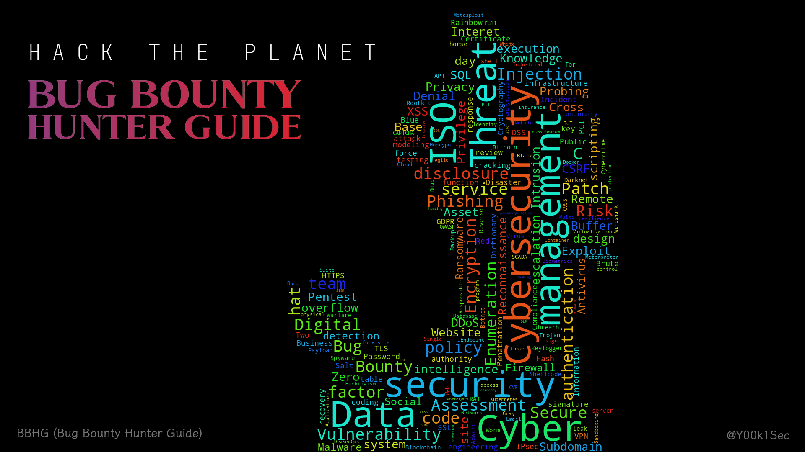

# Bug Bounty Hunter Guide

[**Bug Bounty Hunter Guide**](https://app.gitbook.com/o/EOc6S49gNX0wky8nj5si/s/dIwZJMkFd4Zza9vjuuJ7/) • [Contents](readme/table-of-contents.md) • [Checklists](readme/bug-bounty-checklists.md)

\
   

***

欢迎来到漏洞赏金猎人指南 (Bug Bounty Hunter Guide, BBHG)，一个服务于漏洞赏金猎人的指南。你可以通过 [https://bbhg.yuukiz.com](https://bbhg.yuukiz.com) 在线访问该指南，也可以从 [GitHub 仓库](https://github.com/y00k1sec/bbhg)中查看指南的源码。

该指南旨在提供实用性指导，而非理论性知识，你能从中了解到大量适用于漏洞赏金的命令、网站，以及必要的注意事项。但不能在这里学习到解释其背后原理的知识。此外，指南的内容本身是经过学习和实践之后整理而成的笔记，部分内容可能存在瑕疵和纰漏请谅解。

## Navigation

如果你希望能够快速地对指南的所有内容有一个大致的认知，请参阅根据技术使用范围进行索引的[内容目录 (Table of Contents)](readme/table-of-contents.md)。对于有一定经验的漏洞赏金猎人，我建议参阅[透测试对表 (Pentest Checklists)](readme/bug-bounty-checklists.md)。同时，驱动本站的 GitBook 也提供了一个侧边目录，你也可以使用侧边的目录来查看本指南。

## Disclaimer

本指南的目的是为了提供学习和研究的资源，旨在通过所有技术来提高安全性，而非用于任何恶意的目的。任何因使用本指南内容而产生的负面影响，包括但不限于法律责任和经济损失，与本人无关。使用者应自行承担所有风险。

## License

BBHG 由 @Yuuki 用 🧡 制作，采用 [MIT 许可](https://github.com/y00k1sec/bbhg/blob/main/LICENSE)发布。

<figure><figcaption></figcaption></figure>
