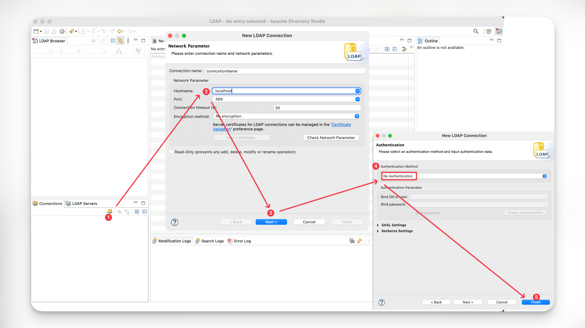

# 389, 636 - LDAP

## Potential Risks

### Unauthenticated Access

```bash
# https://github.com/yuukisec/iPoCs
nuclei -t ~/ipocs -id ldap-unauth -u $RHOST:$RPORT

# Bulk testing
nuclei -t ~/ipocs -id ldap-unauth -l $RHOST_LIST
```

## Exploitation

### Information Disclosure

*   Java Ldap Browser. <[https://www.jxplorer.org/downloads/users.html](https://www.jxplorer.org/downloads/users.html)>

    <figure><figcaption></figcaption></figure>
*   Apache Directory Studio RCP Application. <[https://directory.apache.org/studio/downloads.html](https://directory.apache.org/studio/downloads.html)>

    <figure><figcaption></figcaption></figure>
*   LDAP Admin Tool. <[https://www.ldapsoft.com/download.html](https://www.ldapsoft.com/download.html)>

    <figure><figcaption></figcaption></figure>
