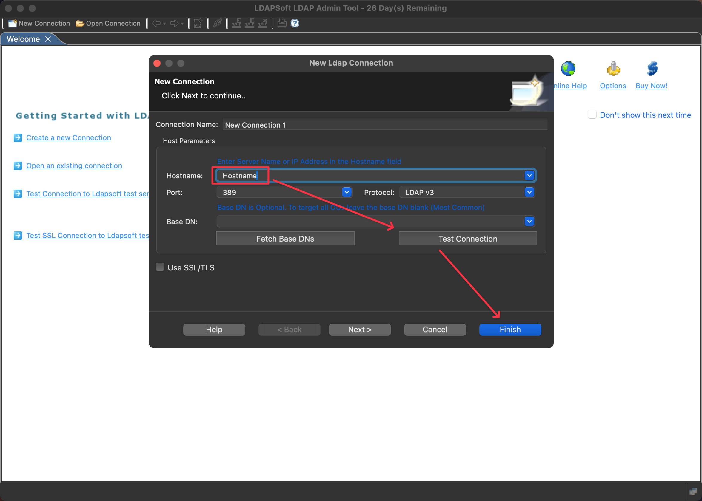

# LDAP

<details>

<summary>Introduction</summary>

LDAP（轻量目录访问协议）是一种用于访问和维护分布式目录信息服务的协议。它提供了一种标准的方法来管理和查询目录中的各种信息，如用户身份、组织结构和网络资源等。LDAP 常用于企业内部的身份认证、访问控制和资源管理，也被广泛应用于互联网服务提供商和电子邮件系统中。LDAP 的设计注重轻量级和效率，使其成为管理大规模网络中用户和资源的理想选择。

</details>

<table><thead><tr><th width="178">Name</th><th>LDAP (Lightweight Directory Access Protocol)</th></tr></thead><tbody><tr><td><strong>Default Port</strong></td><td>389</td></tr><tr><td><strong>GetShell?</strong></td><td>N/A</td></tr><tr><td><strong>Vulnerability</strong></td><td>Unauthorized Access (Leak Information)</td></tr></tbody></table>

## Unauthorized Access

If the LDAP service allows unauthorized access, you can use the [LDAP Admin Tool](https://www.ldapsoft.com/download.html) to connect.

<figure><figcaption></figcaption></figure>

### Batch Testing


```bash
# Single Target
nuclei -t ~/nuclei-templates/http/misconfiguration/unauth-ldap-account-manager.yaml -t BaseUrl
# Multiple Target
nuclei -t ~/nuclei-templates/http/misconfiguration/unauth-ldap-account-manager.yaml -l urls.txt
```



```
https://github.com/projectdiscovery/nuclei-templates/blob/main/http/misconfiguration/unauth-ldap-account-manager.yaml
```


<details>

<summary>Template Details</summary>

```yaml
id: unauth-ldap-account-manager

info:
  name: Unauthenticated LDAP Account Manager
  author: tess
  severity: medium
  description: LDAP Account Manager is exposed to external users.
  metadata:
    verified: true
    max-request: 1
    shodan-query: http.title:"LDAP Account Manager"
  tags: ldap,misconfig,unauth

http:
  - method: GET
    path:
      - '{{BaseURL}}/templates/config/profmanage.php'

    matchers-condition: and
    matchers:
      - type: word
        part: body
        words:
          - 'LDAP Account Manager'
          - 'Profile management'
          - 'Add profile'
        condition: and

      - type: word
        part: header
        words:
          - "text/html"

      - type: status
        status:
          - 200
# digest: 4a0a00473045022100eb37d1c6fabba844b609feb86ee959249326bf888667b194afcb0ff37dd9e91b022037213b13d2f0a714a76ac3f03bd64b5ef49037ed317d3da37ca410ff3d459d98:922c64590222798bb761d5b6d8e72950
```

</details>
